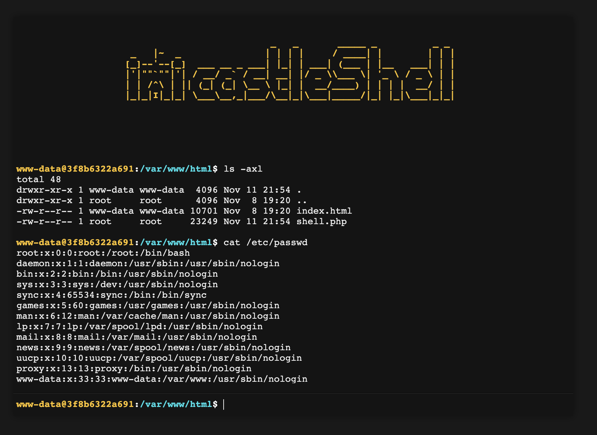
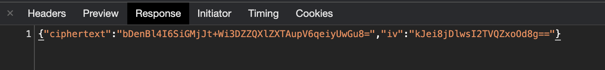

# castleShell - Encrypted PHP web shell

castleShell is a single-file PHP web shell, which uses encryption in order to hide your traces in web logs.

The first step is to establishing a shared key between the back and front end of the shell. This is done by using [Diffie-Hellman key exchange](https://en.wikipedia.org/wiki/Diffie%E2%80%93Hellman_key_exchange), which makes it (practically) impossible to find out the shared key even when all of the mutual communication is logged.
After the key exchange, all communication (e.g. executed commands) gets encrypted and decrypted with the shared key. 

**However, due to some limitations, the last used encryption key gets temporarely stored in the PHP session. You can clear it by either using the `destroy` command or by refreshing the webpage.** 

This web shell is based on [p0wny@shell:~#](https://github.com/flozz/p0wny-shell) but besides having encryption, castleShell also includes a few addional features (marked with `+++`)

**Features**
* Command history (using arrow keys `↑` `↓`)
* Auto-completion of command and file names (using `Tab` key)
* Navigate on the remote file-system (using `cd` command)
* Upload a file to the server (using `upload <destination_file_name>` command)
* Download a file from the server (using `download <file_name>` command)
* Destroy the session and delete the shell (using `destroy` command) **+++**
* Semi-realistic bash prompt **+++**

Here is the encryped output of a command:

## TODO
* A fully interactive PTY shell with colors and stuff. (Requires a complete rewrite.)
* Add longer and more secure Diffie-Hellman groups.

## Known bugs
* Sometimes the key exhange fails, which results in an alert box with an error. Refresh the webpage to try again.
* No terminal colours.
* Failed `cd` command does not output an error.

## Changelog
* **2020-11-11:** Initial release
